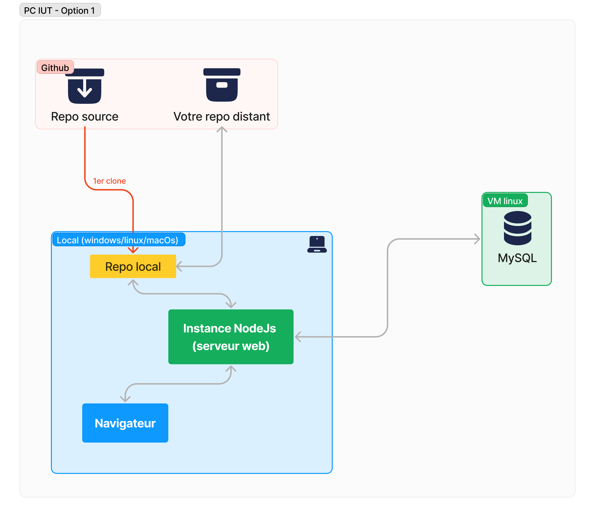
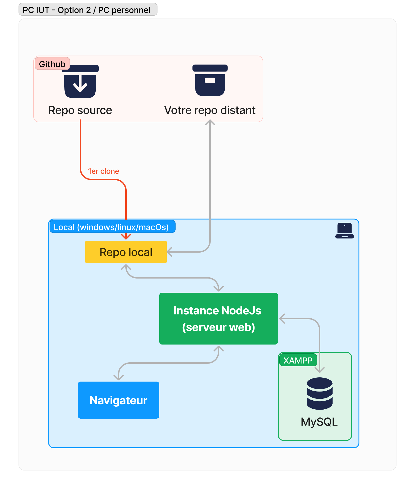

# SAE-S4-bdeinfo.fr

Le repo source pour la SAE S4 sur le site de l'ADIIL bdeinfo.fr \
**Disclaimer** : ce repo n'est pas le code source à jour du site web bdeinfo.fr. Le code source de ce site n'est pas publique.
\
Ce repo sert uniquement aux infos2 du BUT informatique de Laval pour réaliser la SAE S4. Toute autre utilisation du code fourni n'est pas autorisée.

## Guide

Voici les deux architectures possibles du site web :

Option 1 : BDD sur VM de l'IUT :



Option 2 : BDD sur XAMPP (machine de l'IUT ou personnelle) :



### Espace de travail

Pour setup ce projet, vous aurez besoin de **Nodejs** et **npm**. Npm est un gestionnaire de paquets pour Node.js. Ils sont tous deux déjà installés sur les machines de l'IUT. Si votre environnement ne les a pas, vous pouvez les télécharger ensemble [ici](https://nodejs.org/en/download).

Ensuite, ouvrez VScode et sur la page d'accueil, cliquez sur `Clone Repository` et entrez l'url de votre repo. Une fois le repo cloné, cliquez sur `Terminal` en haut à gauche, puis `New Terminal`. Dans ce terminal, tapez `npm i` pour installer les dépendances du projet.

### Base de donneés

Vous aurez besoin d'une base de données MYSQL. Cela dépend de votre environnement de travail.

#### 1. Machines de l'IUT

Vous utiliserez soit une base de données hébergée sur une VM qui vous est attribué par équipe par l'IUT, soit XAMPP. Si vous optez pour la deuxième option, veuillez vous référrer au [petit 2](#2-machine-personnelle-ou-machine-de-liut-avec-xampp). Pour vous connecter à la base de donneés de la VM de votre groupe, ouvrez un terminal, connectez-vous en SSH à la VM avec les identifiants fournis puis tapez :

```bash
mysql -u root -p
```

Entrez le mot de passe fourni puis tapez les commandes suivantes une par une :

```sql
CREATE DATABASE bdeinfo;
GRANT ALL PRIVILEGES ON bdeinfo.* TO 'etu'@'%' WITH GRANT OPTION;
flush privileges;
exit;
```

Ensuite, pour copier la structure de la base de données sur la VM, ouvrez un nouveau terminal dans le dossier de votre espace de travail (vous pouvez le faire dans VSCode en cliquand sur **Terminal** puis **New Terminal**), puis tapez :

```bash
scp bdeinfo.sql username@ip:/path/to/destination
```

Et remplacez `username` par votre nom d'utilisateur et `ip` par l'adresse IP de la VM. Vous pouvez fermer le deuxième terminal.

Ensuite, pour importer la structure de la base de données et un petit jeu de données, dans votre terminal ssh, tapez :

```bash
mysql -u root -p bdeinfo < /path/to/bdeinfo.sql
```

Ensuite, pour configurer mariadb, tapez :

```bash
sudo nano /etc/mysql/mariadb.conf.d/50-server.cnf
```

Et trouvez la ligne suivante :

```conf
bind-address = 127.0.0.1
```

Et remplacez-la avec :

```conf
bind-address = 0.0.0.0
```

Vous pouvez quitter le fichier avec `Ctrl + X`, puis `Y` pour confirmer les changements, puis `Enter` pour sauvegarder.

Ensuite, ouvrez le fichier suivante :

```bash
sudo nano /etc/mysql/mariadb.cnf
```

et ajoutez la ligne suivante à la fin du fichier :

```conf
port = 33061
```

Vous pouvez fermer le fichier avec `Ctrl + X`, puis `Y` pour confirmer les changements, puis `Enter` pour sauvegarder.

Ensuite, redémarrez mysql avec :

```bash
service mysql restart
```

#### 2. Machine personnelle (ou machine de l'IUT avec XAMPP)

Vous devez installer une base de données mysql sur votre machine. Ainsi, chaque membre du groupe aura une base de données différente. Pour cela, si vous êtes sur votre machine perso, téléchargez [XAMPP](https://www.apachefriends.org/fr/download.html) si vous ne l'avez pas encore et suivez les instructions d'installation.
\
Ouvrez le panneau de contrôle de XAMPP et démarrez les services `Apache` et `MySQL`. Ensuite, ouvrez votre navigateur et allez à l'adresse `localhost/phpmyadmin`.
\
 Connectez-vous avec le nom d'utilisateur `root` et laissez le mot de passe vide. Créez une nouvelle base de données nommée `bdeinfo` et importez le fichier `bdeinfo.sql` dans cette base de données.

### Configuration

Maintenant, pour configurer le serveur, créez un fichier `.env` à la racine du projet. Dans ce fichier, ajoutez les lignes suivantes :

```env
DB_HOST=VOTREIP
DB_PORT=33061
DB_USER=etu
DB_PASS=VOTREMOTDEPASSE
DB_NAME=bdeinfo
```

Remplacez `VOTREIP` par l'ip de votre VM (ou localhost avec XAMPP) et `VOTREMOTDEPASSE` par le mot de passe de votre base de données. Si vous utilisez XAMPP, remplacez `DB_PORT` par `3306` et entrez les informations de connexion à votre base de données (nom d'utilisateur et mot de passe) valides.

Ensuite, pour pouvoir avoir un calendrier Google Calendar duquel seront importés les événements, il vous faudra créer un nouveau calendrier sur google calendar. Pour ajouter un évenement, créez un évenement avec le nom, la date et le lieu désiré et écrivez ceci dans la description :

```env
{description : ...}, {prix : ...}, {image: ...}
```

exemple :

```env
{description : Déguisez-vous pour célébrer cet événement !}, {prix : 1.5}, {image:carnaval.webp}
```

Les images que vous utiliserez doivent être placées dans le dossier `public/images/events/`.

Une fois vos événements créés, allez dans les paramètres de votre calendrier, puis dans `Intégrer le calendrier` et copiez le lien `Adresse publique au format iCal`. Ensuite, ouvrez un nouvel onglet et collez-y l'url. Vous devriez voir un fichier `.ics` se télécharger. Déplacez ce fichier dans le dossier `public/ical/` du projet. Un fichier d'exemple `basic.ics` y est déjà, à vous de le remplacer par le votre.
\
\
_Cette méthode n'est pas optimale et le système n'est pas sensé fonctionner comme ça, mais dû aux limitations du réseau de l'IUT, c'est le seul moyen. Libre à vous de l'améliorer / de le remplacer par un système plus optimal_.

Enfin, il faut ajouter ces deux lignes à la fin du fichier .env :

```env
XP_AMOUNT=100
XP_THRESHOLD=1000
```

`XP_AMOUNT` est le montant d'xp que l'utilisateur gagne lors de l'achat d'un produit. `XP_THRESHOLD` est le seuil d'xp à partir duquel l'utilisateur garde son grade après un changement de semestre.

### Lancement

Pour démarrer le serveur, tapez :

```bash
sudo npm run dev
```

dans le terminal et entrez le mot de passe de l'utilisateur **etu**. Le serveur devrait se lancer sur le port 443. Vous pouvez accéder à votre site web ici : <https://localhost>.

Un utilisateur admin est déjà créé dans la base de données. Vous pouvez vous connecter avec les identifiants suivants :

- **pseudo** : `admin`
- **mot de passe** : `admin`

Avec, vous pourrez accéder à l'espace admin du site web ici : <https://localhost/admin>.

## API interne

URL : _`http://localhost/api/`_

_exemple : <http://localhost/api/account/login/>_

### Structure

#### Account : `account/`

| Méthode  | Nom de la route    | Description                                | Paramètres                                                              | Retour                              |
| -------- | ------------------ | ------------------------------------------ | ----------------------------------------------------------------------- | ----------------------------------- |
| **POST** | `login/`           | Connexion                                  | username : string, password : string                                    | success : boolean, message : String |
| **GET**  | `logout/`          | Déconnexion                                | -                                                                       | success : boolean, message : String |
| **POST** | `register/`        | Inscription                                | username : string, password : string, category : string, email : string | success : boolean, message : String |
| **POST** | `nonInfoRegister/` | Inscription sans infos                     | name : string                                                           | success : boolean, message : String |
| **POST** | `verifyEmail/`     | Vérification d'adresse mail                | email : string                                                          | success : boolean, message : String |
| **POST** | `checkPasscode/`   | Vérification du code d'inscription (email) | passcode : string, email : string                                       | success : boolean, message : String |

<br>

#### Help : `help/`

| Méthode  | Nom de la route   | Description                                 | Paramètres                             | Retour                              |
| -------- | ----------------- | ------------------------------------------- | -------------------------------------- | ----------------------------------- |
| **POST** | `forgotPassword/` | Mot de passe oublié                         | email : string                         | success : boolean, message : String |
| **POST** | `verifyPasscode/` | Vérification du code de mot de passe oublié | passcode : string                      | success : boolean, message : String |
| **POST** | `changePassword/` | Changement de mot de passe                  | password1 : string, password2 : string | success : boolean, message : String |

<br>

#### Payment : `payment/`

| Méthode  | Nom de la route | Description             | Paramètres                                                     | Retour                              |
| -------- | --------------- | ----------------------- | -------------------------------------------------------------- | ----------------------------------- |
| **POST** | `checkout/`     | Création d'une commande | items : [{identifier:{id, type}, name, price, quantity, size}] | success : boolean, message : String |

<br>

#### User : `user/`

| Méthode  | Nom de la route  | Description                              | Paramètres                     | Retour                                                           |
| -------- | ---------------- | ---------------------------------------- | ------------------------------ | ---------------------------------------------------------------- |
| **GET**  | `getCartItems/`  | Obtention du panier                      | -                              | items: [{identifier: { id, type }, name,size,price,quantity: 1}] |
| **GET**  | `getEvents/`     | Obtention de l'agenda de l'étudiant      | -                              | events : Object ical                                             |
| **GET**  | `getEventsUser/` | Obtention des insctiptions de l'étudiant | -                              | events : [{event.name, event.date}]                              |
| **GET**  | `getPodiumPfps/` | Obtention des photos de profil du podium | -                              | images : [url]                                                   |
| **POST** | `changeClass/`   | Changement de groupe TP de l'étudiant    | class : string, email : string | success : boolean, message : String                              |
| **POST** | `unsubscribe/`   | Désabonnement                            | -                              | success : boolean, message : String                              |
| **GET**  | `leaderboardd/`  | Obtention du leaderboard                 | -                              | rows : [{username, xp, category, dc_pfp, dc_id}]                 |

<br>

#### Discord : `discord/`

| Méthode  | Nom de la route    | Description                        | Paramètres                                      | Retour                              |
| -------- | ------------------ | ---------------------------------- | ----------------------------------------------- | ----------------------------------- |
| **GET**  | `getDiscordInfos/` | Obtention des infos d'un etudiant  | -                                               | pfp : string, username : string     |
| **POST** | `setDiscordInfos/` | Définition des infos d'un étudiant | avatar : string, username : string, id : string | success : boolean, message : String |

<br>

#### Admin : `admin/`

_(pour le pannel admin : <http://localhost/admin/>)_

| Méthode  | Nom de la route      | Description                                           | Paramètres                                                                                                                                                                                                                                                | Retour                                                                                                                                                                                                                 |
| -------- | -------------------- | ----------------------------------------------------- | --------------------------------------------------------------------------------------------------------------------------------------------------------------------------------------------------------------------------------------------------------- | ---------------------------------------------------------------------------------------------------------------------------------------------------------------------------------------------------------------------- |
| **POST** | `changeBanner/`      | Mise à jour de la bannière publicitaire               | showBanner : Boolean, color : hex color String, textToShow : String, link : String, linkBody : String                                                                                                                                                     | success : boolean, message : String                                                                                                                                                                                    |
| **POST** | `changeXpThreshold/` | Changement du seuil d'xp de renouvellement des grades | xpThreshold : int                                                                                                                                                                                                                                         | success : boolean, message : String                                                                                                                                                                                    |
| **POST** | `changeGradePrices/` | Changement du prix des grades                         | ironprice : int, goldprice : int, diamantprice : int                                                                                                                                                                                                      | success : boolean, message : String                                                                                                                                                                                    |
| **POST** | `sql/`               | Execution de requêtes SQL                             | sql : string                                                                                                                                                                                                                                              | success : boolean, message : String                                                                                                                                                                                    |
| **POST** | `updateGrades/`      | Mise à jour des grades (en fin de semestre)           | -                                                                                                                                                                                                                                                         | success : boolean, message : String                                                                                                                                                                                    |
| **POST** | `removeUser/`        | Suppression d'un utilisateur d'un évenement           | eventId : int, email : string                                                                                                                                                                                                                             | success : boolean, message : String                                                                                                                                                                                    |
| **POST** | `addUser/`           | Ajout d'un utilisateur à un évenement                 | eventId : int, email : string, xp : int                                                                                                                                                                                                                   | success : boolean, message : String                                                                                                                                                                                    |
| **GET**  | `searchUser/`        | Recherche d'utilisateurs                              | value : string, eventId : int, null                                                                                                                                                                                                                       | users : [{username, email}]                                                                                                                                                                                            |
| **GET**  | `getEvents/`         | Obtention des événements (et leurs inscriptions)      | -                                                                                                                                                                                                                                                         | events : [{id, name, price, date, users : [user (email)]}]                                                                                                                                                             |
| **GET**  | `getGradesSales/`    | Obtention du nombre de ventes des grades              | -                                                                                                                                                                                                                                                         | grades : [{name, sales}]                                                                                                                                                                                               |
| **POST** | `product/add`        | Ajout d'un produit                                    | name : string, description : string, price : int, release_date : string, expire_date : string, confirm_threashold : int, is_promoted : boolean, color : string ("color1, color2, color3"), sizes : string ("size1, size2, size3"), image : file           | success : boolean, message : String                                                                                                                                                                                    |
| **POST** | `product/edit`       | Modification d'un produit                             | id : int, name : string, description : string, price : int, release_date : string, expire_date : string, confirm_threashold : int, is_promoted : boolean, color : string ("color1, color2, color3"), sizes : string ("size1, size2, size3"), image : file | success : boolean, message : String                                                                                                                                                                                    |
| **GET**  | `products/`          | Obtention des produits et de leurs ventes             | -                                                                                                                                                                                                                                                         | success : boolean, products : [{id, name, image, description, price, release_date, is_promoted, expire_date, confirm_threashold, [colors], [sizes], sales => [{date, buyer, price, transaction_id, product_details}]}] |
| **POST** | `products/addBuyer`  | Ajout d'un acheteur à un produit                      | productId : int, buyer : string (email), options : string                                                                                                                                                                                                 | success : boolean, message : String                                                                                                                                                                                    |

<br>

#### minecraft : `minecraft/`

vide

<br>

#### ChangeLogs : `changelogs/`

| Méthode | Nom de la route       | Description              | Paramètres       | Retour                         |
| ------- | --------------------- | ------------------------ | ---------------- | ------------------------------ |
| **GET** | `getChangelogs/`      | Obtention des changelogs | -                | changelogsArray : [version]    |
| **GET** | `changelogs/:version` | Obtention d'un changelog | version : string | changelogArray : [changements] |

<br>

#### Nuit de l'info : `ndi/`

| Méthode | Nom de la route | Description                          | Paramètres    | Retour                              |
| ------- | --------------- | ------------------------------------ | ------------- | ----------------------------------- |
| **GET** | `getTeams/`     | Obtention des équipes                | -             | teams : [{name, members : [email]}] |
| **GET** | `getRoom/`      | Obtention de la salle d'une personne | name : string | room : string                       |

<br>

#### Divers : (pas dans l'API)

| Méthode  | Nom de la route           | Description                                                          | Paramètres                   | Retour                                                                                                      |
| -------- | ------------------------- | -------------------------------------------------------------------- | ---------------------------- | ----------------------------------------------------------------------------------------------------------- |
| **POST** | `/removeItemFromCartPort` | Suppression d'un item du panier                                      | id : int                     | success : boolean, message : String, cartSize : int                                                         |
| **POST** | `/addItemToCartPort`      | Ajout d'un item au panier                                            | item-type : String, id : int | success : boolean, message : String, cartSize : int                                                         |
| **POST** | `/loginStatus`            | Status de la connexion de l'utilisateur                              | -                            | isLoggedIn : boolean                                                                                        |
| **POST** | `/getImageLinkPort`       | Obtention d'une image (unsplash) pour un string (nom d'un évenement) | query : string               | imageLink : string, unsplashLink : string, photographerName : string, photographerLink : string             |
| **GET**  | `/getBannerInfo`          | Obtention des infos de la bannière publicitaire                      | -                            | success : boolean, isShown : boolean, color : string, textToShow : string, link : string, linkBody : string |

<style>
    table {
        width: 100%;
    }
</style>
